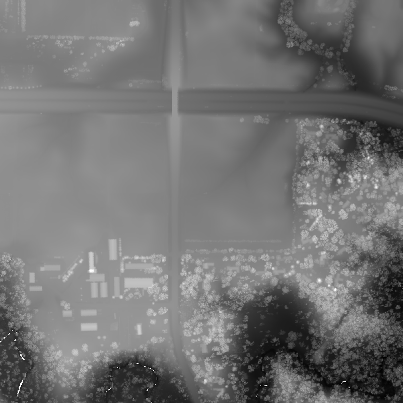
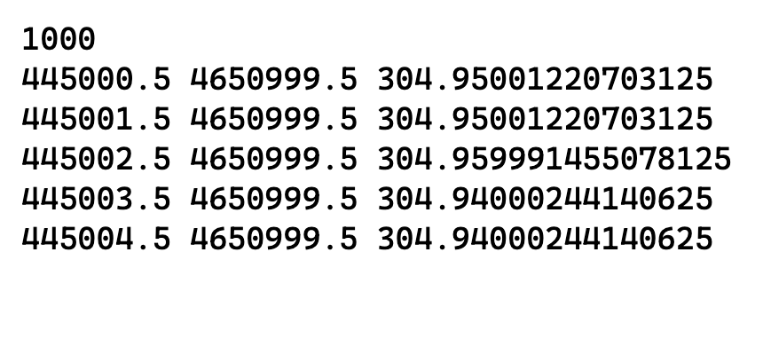

# COMS3270P1

## Overview: 

This project implements a point cloud data processor and visualizer for LIDAR terrain data. It processes data to create visualizations of potential water accumulation and runoff patterns.

## Features:
- Reads and processes 3D point cloud data 
- Creates a grayscale visualization of height data 
- Simulates water flow and accumulation using a cellular automata model 
- Allows for water evaporation and flow coefficients 
- Generates visualizations in a GIF format showing both terrain and water accumulation 
- Generates images according to a specified step size (can be used to create an animation)

## Requirements
- GCC compiler
- Make build system
- Standard C libraries

## Building the project

```bash
git clone <repository-url>
cd coms3270P1
make clean   
make # Build the executable
```


## Running the program
```bash
./watershed <ifile> <iter> <iwater> <wcoef> <ecoef> <ofilebase> [seq]
```
Where 
- `ifile`: input point cloud data file 
- `iter`: number of simulation iterations 
- `iwater`: initial water amount per cell 
- `wcoef`: water flow coefficient (0.0-0.2)
- `ecoef`: evaporation coefficient (0.9-1.0)
- `ofilebase`: Base filename for output files 

Example: 
This should generate a series of images to simulate the water flow
```bash
./watershed terrain.xyz 100 2.0 0.1 0.95 output 10
```

This will generate the the final image of the water simulation: 
```
./watershed terrain.xyz 100 2.0 0.1 0.95 output
```

In the current project, there is a test file called `cleaned_AmesState.xyz` which can help you visualize how the program runs. 

## Input format 

The input should be of the following format: 

```
number_of_columns
x1 y1 height1
x2 y2 height2
...
```
where: <br>
- the first line contains the number of points we're reading (columns)
- Each subsequent line contains the 3D (x, y and z) coordinates of the points

**Example:**
```
1001566
445000.3 4651000.2 304.926666259765625
445001.3 4651000.2 304.947540283203125
445002.3 4651000.2 304.952728271484375
445003.3 4651000.2 304.951354980468750
445004.3 4651000.2 304.942779541015625
445005.3 4651000.2 304.946990966796875
445006.3 4651000.2 304.955963134765625
445007.3 4651000.2 304.963409423828125
...
```

## Output : 

The program generates several types of outputs: 
- Terrain visualization (grayscale GIF)
- Water accumulation visualization (blue-shaded GIF)
- Sequential outputs for animations (when the seq parameter is used)

### Current output: 
With the `cleaned_AmesState.xyz` dataset, the program generates the following terrain: 



Additionally, after simulating the water flow, this is how it looks: 



## Contact : 

For any questions or clarifications, here's my contact:

Name: Shobhit Sarkar

Email: shobhit@iastate.edu 
