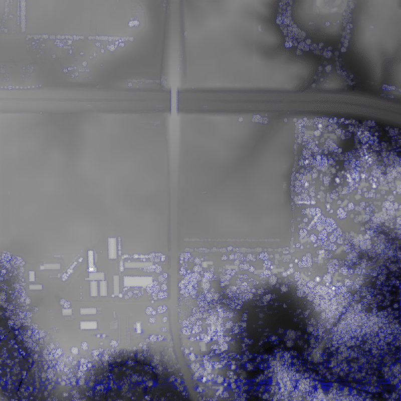

# COMS3270P1

## Overview: 

This project implements a point cloud data processor and visualizer for LIDAR terrain data. It has two parts: 
- Part A: Outputs basic point cloud statistics 
- Part B: Point cloud visualization

## Features:

### Part A: 
- Reads point cloud data from stdin 
- Calculates the minimum and maximum heights (also outputs their locations)
- Computes the average of all data points 
- Outputs statistics to stdout 

### Part B: 
- Reads point cloud data (see below for the correct input format)
- Creates a 800*800 black and white visualization of the points given 
- Maps the terrain heigts to grayscale values (where, black is the lowest and white is the hightest)
- Outputs the visualization in a GIF format. 

## Requirements
- GCC compiler
- Make build system
- Standard C libraries

## Building the project

```bash
git clone <repository-url>
cd coms3270P1
```

### For part A: 
```
git checkout partacomplete
make clean 
make stat
```
Running these commands should create an executable named `stat`. 

### For part B: 
```
git checkout partab 
make clean 
make display
``` 
Running these commands shoudld create an executable named `display`.


## Running the program

### Part a: 
```
./stat < test.xyz
```
On doing so, you should see something like this: 
```
Minimum height: 284.21 at grid location (445995.5, 4650000.5)
Maximum height: 304.95 at grid location (445000.5, 4650999.5)
Average height of all data points: 294.58
```

### Part b: 
```
./display < testfile.xyz
```
Doing so should create a file called `out.gif` in the current directory which is the grayscale visualization of the terrain provided. 

## Input format 

### Part a: 
```
x1 y1 height1
x2 y2 height2
...
```
### Part b: 
```
number_of_cols
x1 y1 height1
x2 y2 height2
...
```
where: 
- `number_of_cols` total number of points in the dataset 
- `x,y`: grid coordinates 
- `height`: elevation at that point 

**Example for part - a:** 


**Example for part - b:**


## Output : 

### Part a: 
We get an output to the console telling us the following: 
- Minimum height and it's location 
- Maximum height and it's location 
- Average height accross all the points 

### Part b: 
- Generates an output file called `out.gif`
- 800*800 pixel grayscale image 
- Black shows the lowest elevation 
- White shows the highest elevation 
- The amounts of black and white represents the varying heights 

### Current output: 
With the `cleaned_AmesState.xyz` dataset, the program gives the following output : 


(This is the landscape of the Iowa State Bridge crossing Highway 30!)

## Other Implementation Details: 
- Uses an expanding array similar to Java's arraylist for storing the points 
- Manages memory using `alloc` and `free`

## Common Issues and their Solutions: 
1. If the output appears blank: 
    - Check if the input file has the correct format 
    - Verify that the points are within close range. This ensures that the image is scaled properly. 
2. If the visualization is too dark or light: 
    - Data points might be too close to each other 
    - Height ranges might be too small 

## Contact : 

For any questions or clarifications, here's my contact:

Name: Shobhit Sarkar

email : shobhit@iastate.edu 
___ 
For branch: :heart: